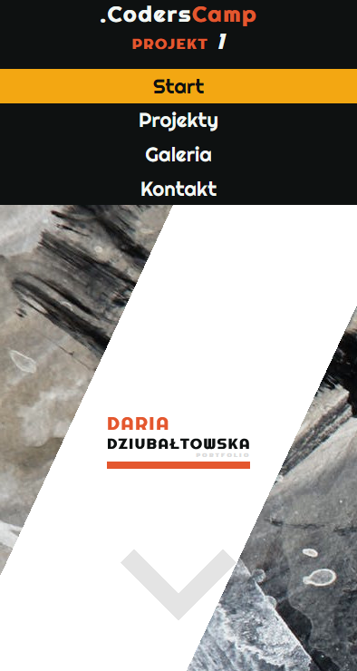

# Projekt HTML & CSS — Wizytówka / Portfolio
Pierwszy projekt CodersCamp 2020. Projekt ukończony. Strona wykonana z wykorzystaniem **HTML i CSS**, zgodnie z wymogami projektu nie użyto języka JavaScript, gotowych bibliotek stylów, czy frameworków.

Demo --> https://daria305.github.io/CodersCamp-project1/

## Design
Projekt wykonany w nowoczesnym stylu, strona główna w formie banneru dostosowującego się do ekranu użytkownika. Możliwe szybkie przewinięcie banneru do następnej sekcji po przez klikniecie na strzałkę. Tak samo możliwy jest szybki powrót na górę z samego dołu strony. Dodatkowo najważniejsze sekcje wyszczególnione są na pasku nawigacyjnym u góry strony. Wszystkie odnośniki i zdjęcia wzbogacone są o odpowiednio dobrane animacje i efekty, m.in.:
 - animacja startowa nagłówka na stronie startowej,
 - efekty w sekcji projekty, najechanie ukazuje dodatkowe informacje i link.
 - efekt ukazujący dodatkowe informacje dotyczące zdjęcia

Stopka zawiera odnośniki do social mediów w formie icon dopasowanych do stylu strony. Strona jest responsywna, dostosowana zarówno do urządzeń desktopowych jak i mobilnych. Pasek nawigacji pozostaje na widoku przez całą długość strony, w wersji dla urządzeń mobilnych, celowo zrezygnowano z tej opcji, w celu jak najlepszego wykorzystania i tak już niewielkiej wielkości ekranu.

 - Strona na PC

 - Strona na urządzeniu mobilnym

## Elementy projektu
 - Na **stronie głównej** użytkownik znajdzie sekcje takie jak: 

    - *O mnie* - sekcja ta może zawierać inforamcje o autorze strony.
    
    - *Moje projekty* - przykładowa sekcja prezentująca odnośniki do projektów oraz krótkie opisy.
    

    - *Umiejętności* - niestandardowa forma listy w której można wypunktować np technologie.

    - *Na koniec* - sekcja na samym dole strony głównej zachęcająca użytkownika do dalszej esploracji, bądź nawiązania kontaktu z właścicielem strony.

 - W zakładce **Galeria** autor strony postanowił zaprezentować przykładową galerię zdjęć. W swojej obecnej formie nawiązuje ona do zainteresowań autora.
  

 - W zakładce **Kontakt** znajduje się formularz kontaktowy.
 

